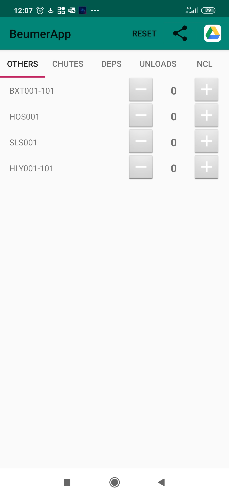
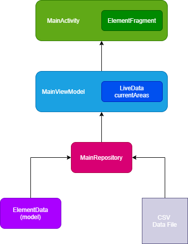

# Beumer frequency app

The Beumer frequency app is an android application designed by me to facilitate my work.
 Beumergroup wants its site engineers to collect data about errors that occur during production on its sortation machine. Previously this would be done by tallying the number of errors in particular areas on a piece of paper. Since it is tedious to carry around a piece of paper and fold it open to mark an error every time, I decided to move this process to my phone.

# Main features

- System error tracking by area
- Persistent error frequency data
- Send error frequency data by e-mail, Whatsapp as a CSV-file

# General architecture

The architecture of the Beumer frequency app makes use of a model-view-viewmodel (MVVM) pattern. Much of the architecture is inspired by Google&#39;s [guide to app architecture.](https://developer.android.com/jetpack/docs/guide)

_Figure 1: App architecture_

## Repository

The Main Repository is a central place in which all data operations are performed. The repository loads persistent data from files and stores new data in files. It populates the model with data and passes it on to the Main Viewmodel. The repository only saves new data to files when it is needed. As long as data can be temporarily stored inside the Viewmodel, the repository is inactive.

## Model

The model is represented by a single list of objects, named Elements. An Element represents a type of element in the sortation system, with data on the frequency of errors from that type of element.

## Viewmodel

The Main Viewmodel controls the state of the view and holds temporary data. It retrieves persistent data from the Main Repository. It stores the current element in view and creates a Livedata observable of the frequency data from the current element. The Livedata observable allows the Viewmodel to mutate data inside of the view without a reference of the view. When the Android activity connected to the view is paused, the Main Viewmodel passed the updated temporary data to the Main Repository for persistent storage.

## View

The view is represented by the Main Activity, including its corresponding main\_layout XML-file. Inside of main\_layout there is a custom view component called &#39;ElementSwitcher&#39;. This is an extension of Framelayout that holds the UI elements of the current element. &#39;ElementSwitcher&#39; is populated with the view &#39;element\_view&#39; of a corresponding ElementFragment. Together with a Tablayout, the ElementSwitcher is responsible for changing the data inside of ElementFragment (by calling a method in Main Viewmodel) when a user clicks on a new tab.
